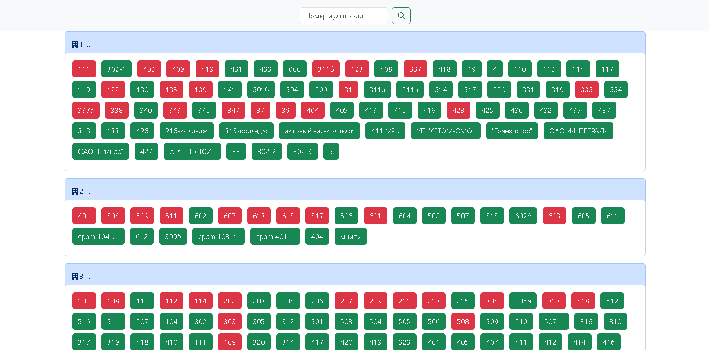
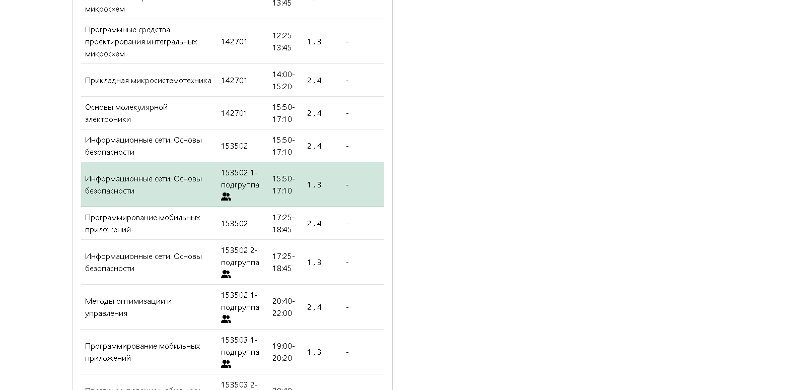
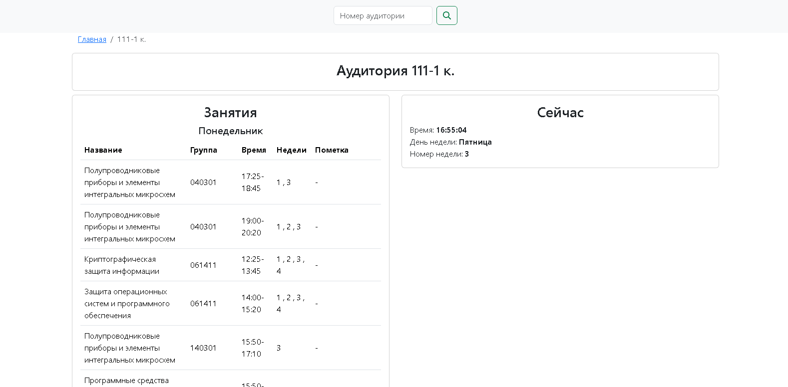
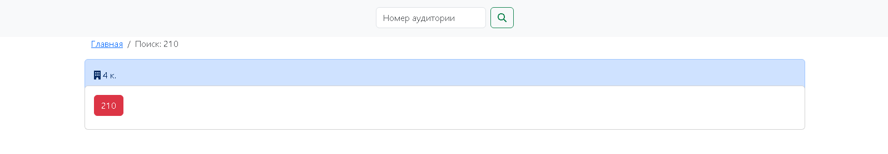
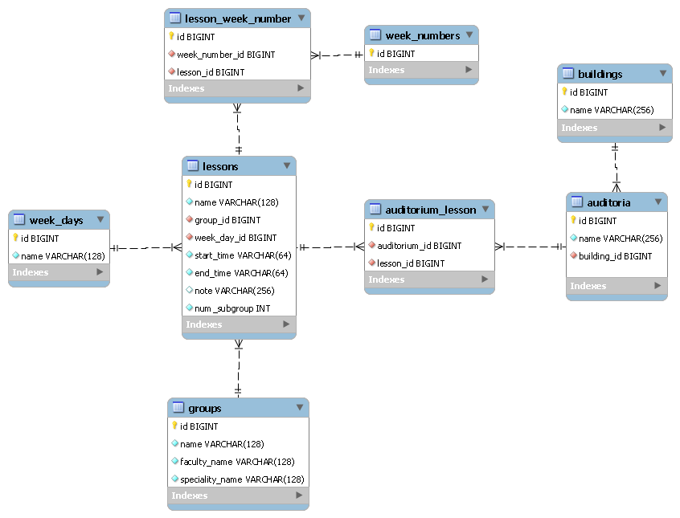

## About
This application allows you to track free and occupied classrooms at BSUIR universities.
API is used to obtain information: https://iis.bsuir.by/api

## Setup
- You need PHP 8.2 and Composer
- Execute composer install
- Execute php artisan migrate
- Make cron in crontab -e command: * * * * * cd /path/to/bsuir-auditoriums.by/ && php artisan schedule:run >> /dev/null 2>&1

Or you may use laravel sail: https://laravel.com/docs/11.x/sail#main-content

## TODO
- nothing

## Images

---

---

---

---

